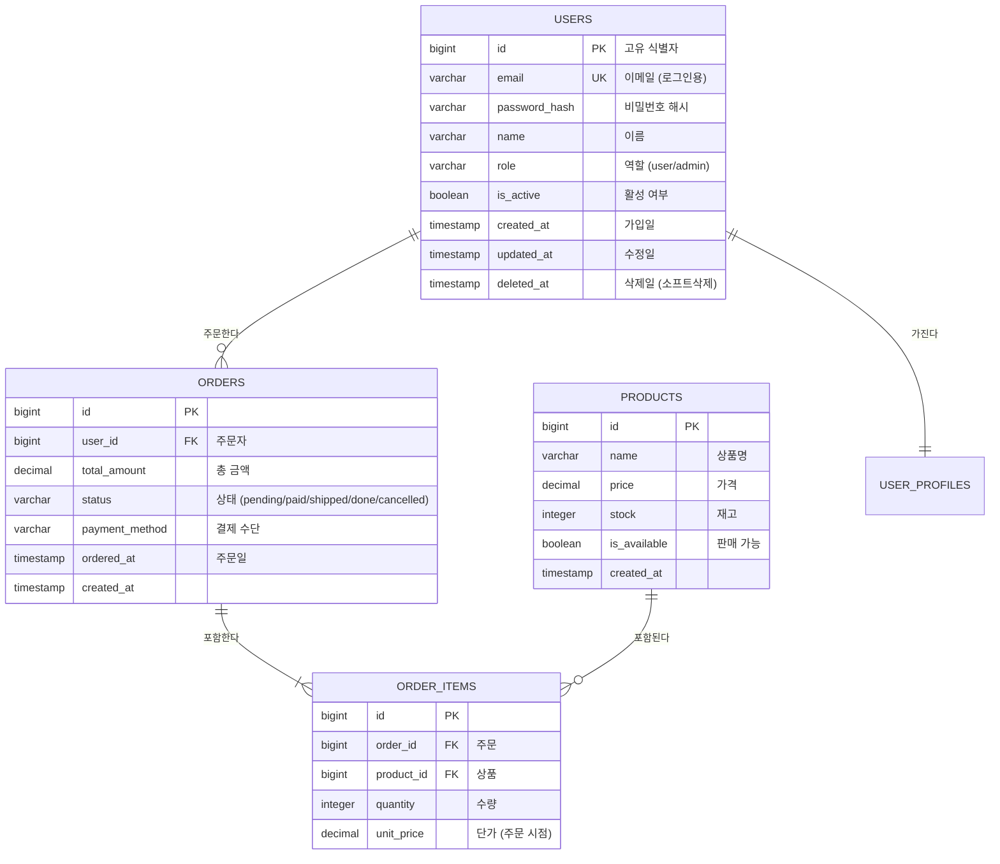
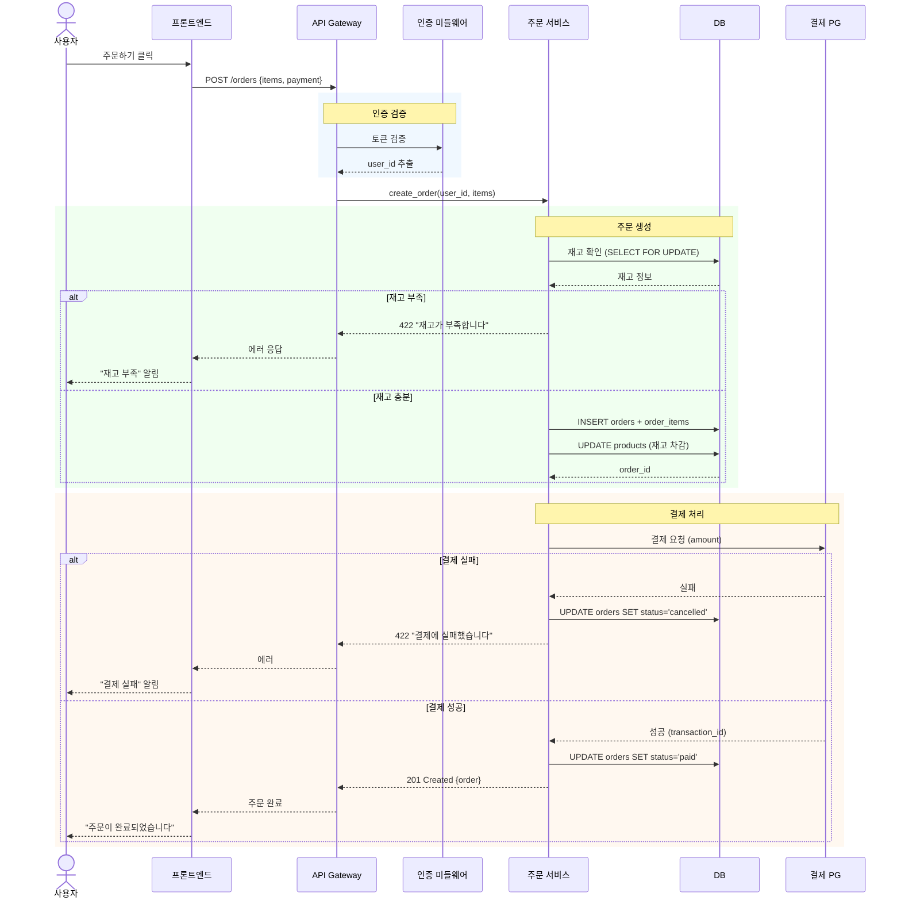
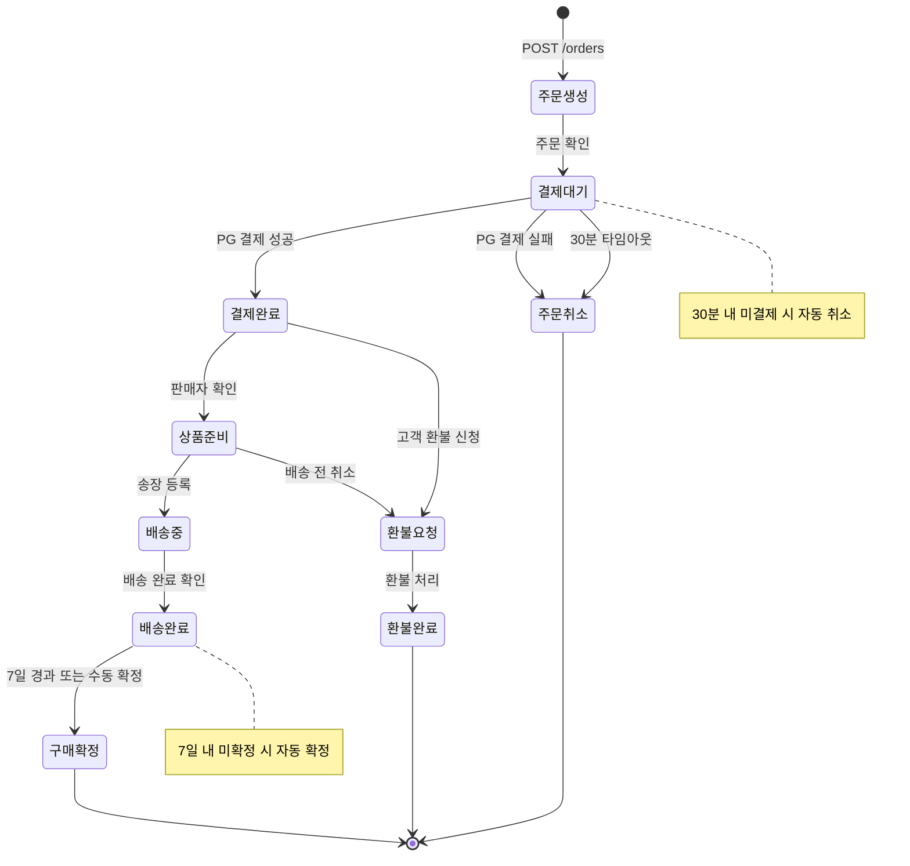
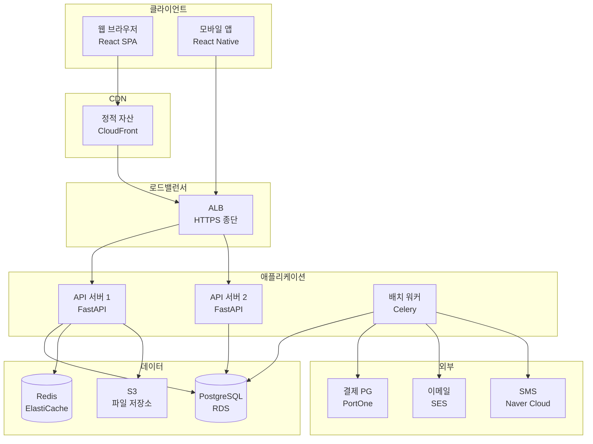
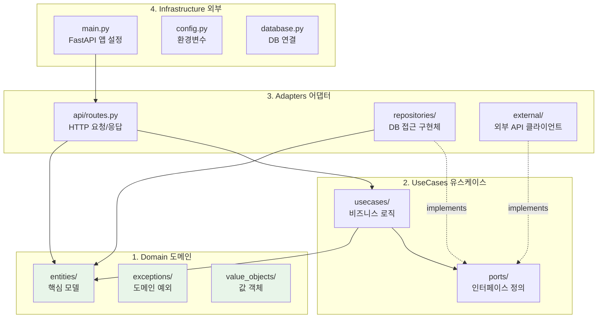
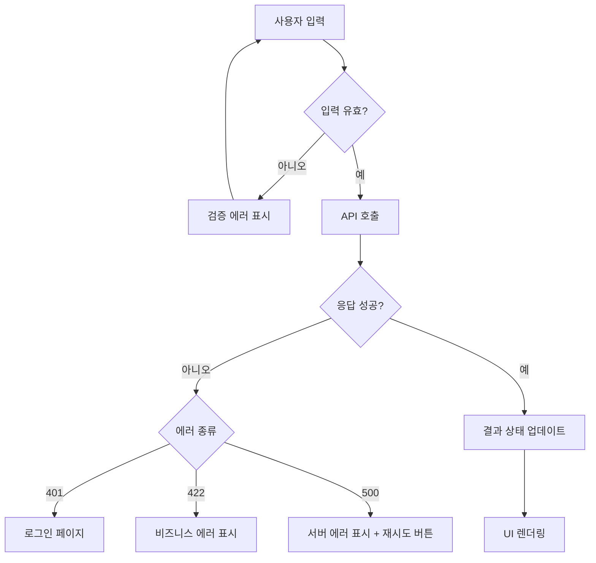

# 다이어그램 작성 가이드 (상용 수준)

design-reviewer가 다이어그램을 생성할 때 참고하는 가이드.

---

## 1. 다이어그램 선택 기준

| 표현하고 싶은 것 | 다이어그램 | 우선순위 |
|:--|:--|:--|
| DB 테이블 관계 | `erDiagram` | 데이터 모델 설계 시 필수 |
| API 요청/응답 흐름 | `sequenceDiagram` | API 설계 시 필수 |
| 전체 시스템 구성 | `graph TD` (flowchart) | 아키텍처 문서 필수 |
| 상태 변화 (주문, 결제 등) | `stateDiagram-v2` | 상태가 있는 엔티티에 필수 |
| 클래스/모델 구조 | `classDiagram` | 도메인 모델 복잡할 때 |
| 레이어 의존성 | `graph TD` + subgraph | 클린 아키텍처 시 |
| 컴포넌트 트리 | `graph TD` | 프론트엔드 구조 설명 시 |
| 배포 구조 | `graph LR` | 배포 환경 설명 시 |
| 의사결정 분기 | `flowchart TD` | 복잡한 비즈니스 로직 |
| 타임라인 | `timeline` | 프로젝트 로드맵 |

---

## 2. 작성 규칙

### 필수 규칙
- GitHub Markdown에서 바로 렌더 가능한 문법만 사용
- 노드 텍스트는 **한국어** (코드명은 영어 병기 가능)
- 한 다이어그램에 **노드 10개 이하** — 복잡하면 분리
- 다이어그램 바로 아래에 **한 줄 설명** 추가
- 관계 화살표에는 **동작을 나타내는 라벨** 사용

### 품질 기준
- 누가 봐도 5초 안에 전체 흐름을 파악할 수 있어야 한다
- 세부 사항은 다이어그램이 아니라 문서에 적는다
- 색상/스타일은 구분이 꼭 필요할 때만 사용

### 안티패턴
- 모든 걸 한 다이어그램에 넣는 것 → **분리**
- 노드 이름이 영어 약어만 있는 것 → **한국어 병기**
- 화살표에 라벨이 없는 것 → **동작 명시**
- 다이어그램만 있고 설명이 없는 것 → **설명 추가**

---

## 3. 다이어그램 유형별 예시

### 3.1 ERD — 테이블 관계 (필수 속성 포함)



> 주문 시스템의 핵심 4개 테이블. ORDER_ITEMS의 unit_price는 주문 시점 가격을 보존한다.

### 3.2 시퀀스 — 정상 + 에러 흐름 포함



> 주문 생성 전체 흐름. 재고 부족/결제 실패 분기를 포함한다.

### 3.3 상태 다이어그램 — 전이 조건 포함



> 주문 상태 전이. 타임아웃 자동 전이와 환불 분기를 포함한다.

### 3.4 시스템 아키텍처 — subgraph 활용



> 프로덕션 배포 아키텍처. CDN, 로드밸런서, 이중화된 API 서버를 포함한다.

### 3.5 레이어 의존성 — 클린 아키텍처



> 의존성은 안쪽으로만 향한다. 점선은 인터페이스 구현을 나타낸다.

### 3.6 컴포넌트 트리 — 프론트엔드

```mermaid
graph TD
    A["App\n(레이아웃 + 라우팅)"]
    
    subgraph 페이지
        B[HomePage]
        C[ProductListPage]
        D[ProductDetailPage]
        E[CartPage]
        F[OrderPage]
    end

    subgraph 공통 컴포넌트
        G[Header\n(네비게이션)]
        H[Footer]
        I[Modal]
        J[LoadingSpinner]
    end

    subgraph 훅
        K["useAuth\n(인증 상태)"]
        L["useCart\n(장바구니)"]
        M["useApi\n(API 호출)"]
    end

    A --> G
    A --> H
    A --> B
    A --> C
    A --> D
    A --> E
    A --> F

    B -.-> M
    C -.-> M
    D -.-> L
    E -.-> L
    F -.-> K
    F -.-> L
```

> 실선은 렌더링 관계, 점선은 훅 사용 관계를 나타낸다.

### 3.7 데이터 흐름 — flowchart



> 프론트엔드의 API 호출 흐름. 에러 종류별 처리 분기를 포함한다.

---

## 4. 다이어그램 조합 가이드

### MVP 프로젝트 (최소)
1. 시스템 아키텍처 (graph) — 1개
2. API 시퀀스 (sequenceDiagram) — 핵심 흐름 1~2개
3. ERD (erDiagram) — DB 있으면 1개

### 프로덕션 프로젝트 (권장)
1. 시스템 아키텍처 — 1개
2. 레이어 구조 — 1개
3. ERD — 1개
4. 핵심 API 시퀀스 — 주요 흐름별 1개씩
5. 상태 다이어그램 — 상태가 있는 엔티티별 1개
6. 컴포넌트 트리 — 프론트엔드 있으면 1개
7. 배포 구조 — 배포 환경이 복잡하면 1개

---

## 5. Mermaid 렌더링 주의사항

### GitHub에서 안 되는 것
- `%%` 주석은 일부 렌더러에서 무시됨
- `classDiagram`에서 제네릭 `<>` 표기 시 `~`로 대체 (예: `list~str~`)
- subgraph 이름에 특수문자 제한
- `\n` 줄바꿈은 일부 렌더러에서 `<br/>`로 대체 필요

### MCP (mcp__mermaid__generate) 사용 시
- PNG/SVG 파일로 저장: `folder` 파라미터에 절대 경로
- 테마: default, forest, dark, neutral
- 배경색: white 권장 (문서 인쇄/공유 시)
