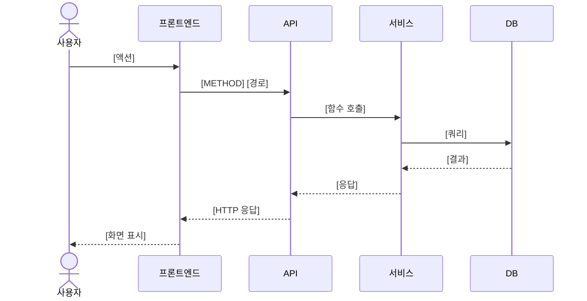

# API 문서 템플릿 (상용 수준)

아래 템플릿을 프로젝트에 맞게 조정해서 사용한다.

---

# API 문서: [프로젝트명]

- 작성일: [YYYY-MM-DD]
- 최종 수정: [YYYY-MM-DD]
- 버전: v[N]

---

## 1. 기본 정보

| 항목 | 값 |
|:--|:--|
| Base URL (개발) | `http://localhost:8000` |
| Base URL (프로덕션) | `https://api.example.com` |
| API 접두사 | `/api/v1` |
| 프로토콜 | HTTPS (프로덕션) / HTTP (개발) |
| 인증 방식 | [없음 / JWT Bearer / API Key] |
| 응답 형식 | `application/json` |
| 문자 인코딩 | UTF-8 |
| 타임존 | UTC (ISO 8601: `2026-04-05T09:00:00Z`) |
| 최대 요청 크기 | [10MB / 설정에 따라] |
| Swagger UI | `[Base URL]/docs` |
| ReDoc | `[Base URL]/redoc` |

---

## 2. 인증

> 인증이 없는 프로젝트는 이 섹션을 "인증 없음 (개인 사용)" 으로 축약

### 2.1 JWT Bearer Token

```
Authorization: Bearer {access_token}
```

| 토큰 | 만료 | 발급 | 갱신 |
|:--|:--|:--|:--|
| access_token | 30분 | POST /auth/login | POST /auth/refresh |
| refresh_token | 14일 | POST /auth/login | 재로그인 |

### 2.2 인증이 필요한 엔드포인트

인증이 필요한 엔드포인트에 토큰 없이 요청하면 `401 Unauthorized`를 반환한다.

---

## 3. 공통 응답 형식

### 3.1 성공 응답 (단건)

```json
{
  "id": 1,
  "name": "값",
  "created_at": "2026-04-05T09:00:00Z"
}
```

### 3.2 성공 응답 (목록 + 페이지네이션)

```json
{
  "data": [
    {"id": 1, "name": "값"},
    {"id": 2, "name": "값"}
  ],
  "pagination": {
    "page": 1,
    "size": 20,
    "total_count": 150,
    "total_pages": 8,
    "has_next": true,
    "has_prev": false
  }
}
```

### 3.3 에러 응답

```json
{
  "error": {
    "code": "ERROR_CODE",
    "message": "사용자에게 보여줄 메시지",
    "details": [
      {"field": "email", "message": "이메일 형식이 올바르지 않습니다."}
    ]
  }
}
```

- `details`는 검증 에러(400)일 때만 포함
- `message`는 한국어로 사용자에게 직접 보여줄 수 있는 수준
- `code`는 프론트엔드에서 에러 분기 처리에 사용

---

## 4. 공통 에러 코드

| HTTP | 에러 코드 | 의미 | 발생 상황 |
|:--|:--|:--|:--|
| 400 | VALIDATION_ERROR | 입력값 검증 실패 | 필드 형식, 범위, 길이 위반 |
| 400 | INVALID_REQUEST | 잘못된 요청 | 비즈니스 규칙 위반 |
| 401 | UNAUTHORIZED | 인증 필요 | 토큰 없음 |
| 401 | TOKEN_EXPIRED | 토큰 만료 | access_token 만료 |
| 401 | INVALID_TOKEN | 유효하지 않은 토큰 | 변조/잘못된 토큰 |
| 403 | FORBIDDEN | 권한 없음 | 해당 리소스 접근 권한 없음 |
| 404 | NOT_FOUND | 리소스 없음 | 존재하지 않는 ID |
| 409 | CONFLICT | 충돌 | 이미 존재하는 리소스 |
| 413 | PAYLOAD_TOO_LARGE | 요청 크기 초과 | 파일 크기 제한 초과 |
| 422 | UNPROCESSABLE | 처리 불가 | 논리적으로 처리 불가능 |
| 429 | RATE_LIMITED | 요청 초과 | API 호출 빈도 제한 |
| 500 | INTERNAL_ERROR | 서버 에러 | 예상치 못한 서버 오류 |
| 502 | BAD_GATEWAY | 외부 서비스 오류 | 외부 API 호출 실패 |
| 503 | SERVICE_UNAVAILABLE | 서비스 불가 | 점검 중, 과부하 |

---

## 5. 페이지네이션

목록 API에 공통 적용되는 쿼리 파라미터:

| 파라미터 | 타입 | 기본값 | 범위 | 설명 |
|:--|:--|:--|:--|:--|
| page | integer | 1 | 1~ | 페이지 번호 |
| size | integer | 20 | 1~100 | 페이지당 항목 수 |
| sort | string | created_at | 필드명 | 정렬 기준 |
| order | string | desc | asc/desc | 정렬 방향 |

---

## 6. 엔드포인트 목록

| 메서드 | 경로 | 설명 | 인증 | 비고 |
|:--|:--|:--|:--|:--|
| [METHOD] | [/api/v1/path] | [설명] | [O/X] | |

---

## 7. 엔드포인트 상세

### 7.1 [카테고리명]

#### [METHOD] [경로]

[이 API가 하는 일 한 줄 설명]

**인증**: [필요/불필요]
**권한**: [전체/본인만/관리자만]

##### 요청

**헤더**

| 헤더 | 값 | 필수 |
|:--|:--|:--|
| Content-Type | [application/json / multipart/form-data] | O |
| Authorization | Bearer {token} | [O/X] |

**Path Parameters**

| 파라미터 | 타입 | 설명 |
|:--|:--|:--|
| id | integer | 리소스 ID |

**Query Parameters**

| 파라미터 | 타입 | 필수 | 기본값 | 설명 |
|:--|:--|:--|:--|:--|
| [name] | [type] | [O/X] | [값] | [설명] |

**Request Body**

| 필드 | 타입 | 필수 | 검증 규칙 | 설명 |
|:--|:--|:--|:--|:--|
| [name] | [type] | [O/X] | [규칙] | [설명] |

**요청 예시**

```bash
# curl
curl -X [METHOD] http://localhost:8000/api/v1/[path] \
  -H "Content-Type: application/json" \
  -H "Authorization: Bearer {token}" \
  -d '{"field": "value"}'
```

```python
# Python (httpx)
async with httpx.AsyncClient() as client:
    response = await client.post(
        "http://localhost:8000/api/v1/[path]",
        json={"field": "value"},
        headers={"Authorization": f"Bearer {token}"}
    )
```

```typescript
// TypeScript (fetch)
const response = await fetch('/api/v1/[path]', {
  method: '[METHOD]',
  headers: {
    'Content-Type': 'application/json',
    'Authorization': `Bearer ${token}`,
  },
  body: JSON.stringify({ field: 'value' }),
});
```

##### 응답

**성공** ([상태코드])

| 필드 | 타입 | 설명 |
|:--|:--|:--|
| [name] | [type] | [설명] |

```json
{
  "field": "value"
}
```

**에러**

| 상태 코드 | 에러 코드 | 상황 | 응답 예시 |
|:--|:--|:--|:--|
| [코드] | [ERROR_CODE] | [상황] | `{"error": {"code": "...", "message": "..."}}` |

---

## 8. 흐름 다이어그램

### 8.1 [흐름명] 시퀀스



---

## 9. 변경 이력

| 버전 | 날짜 | 변경 내용 |
|:--|:--|:--|
| v1 | [YYYY-MM-DD] | 최초 작성 |

---

## 10. 파일 위치

| 역할 | 파일 |
|:--|:--|
| 라우터 | [경로] |
| 도메인 모델 | [경로] |
| Swagger UI | [URL] |
