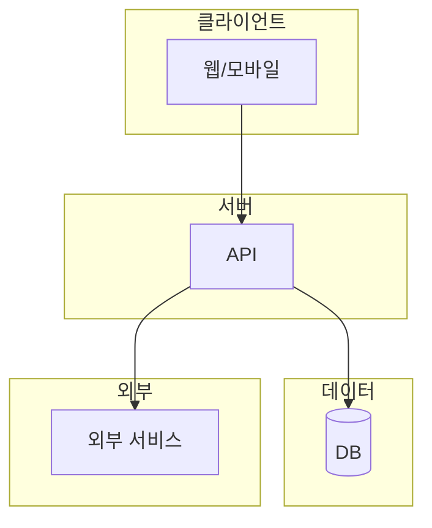
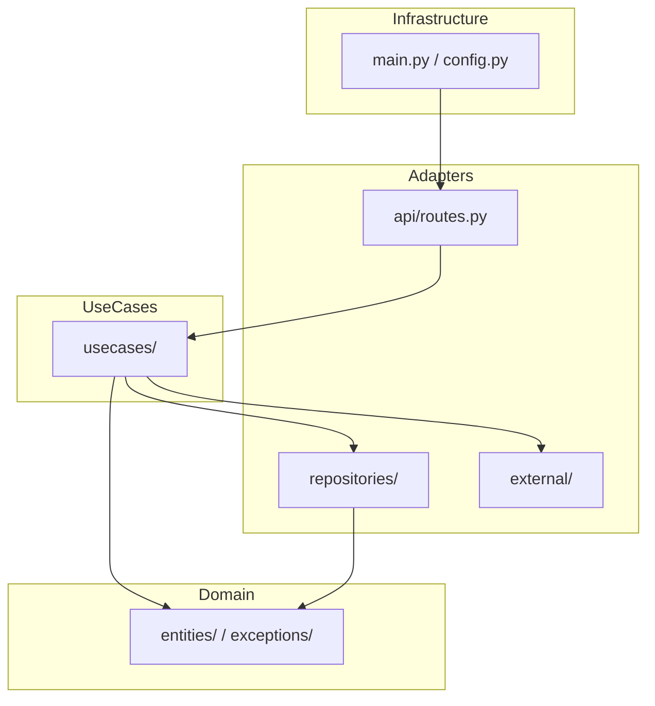
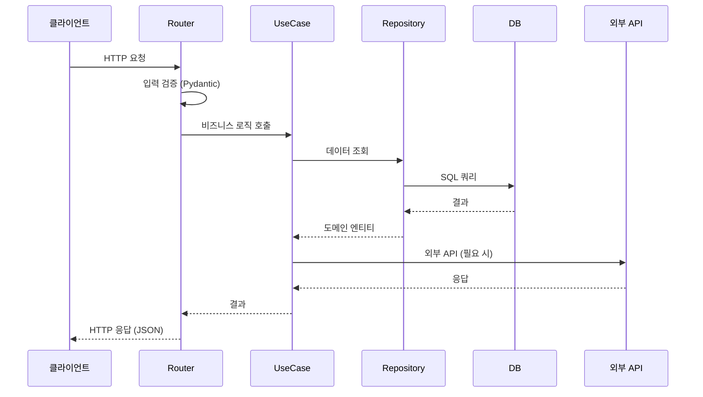

# 아키텍처 문서 템플릿 (상용 수준)

---

# 아키텍처 문서: [프로젝트명]

- 작성일: [YYYY-MM-DD]
- 최종 수정: [YYYY-MM-DD]
- 스프린트: [N]

---

## 1. 시스템 개요

### 1.1 한 줄 요약

[이 시스템이 무엇을 하는지 한 문장으로]

### 1.2 전체 구성도



> [한 줄 설명]

### 1.3 네트워크 구성

```
[클라이언트] ──HTTP──▶ [프론트 :포트] ──프록시──▶ [백엔드 :포트] ──HTTPS──▶ [외부 API]
```

| 구간 | 프로토콜 | 포트 | 비고 |
|:--|:--|:--|:--|
| 클라이언트 ↔ 프론트 | HTTP | [5173] | 개발: Vite, 프로덕션: Nginx |
| 프론트 ↔ 백엔드 | HTTP | [8000] | 개발: Vite 프록시 |
| 백엔드 ↔ DB | TCP | [5432] | [PostgreSQL/SQLite] |
| 백엔드 ↔ 외부 API | HTTPS | 443 | [외부 서비스명] |

---

## 2. 레이어 구조

### 2.1 레이어 다이어그램



### 2.2 각 레이어 책임

| 레이어 | 책임 | 하면 안 되는 것 | 파일 |
|:--|:--|:--|:--|
| **Domain** | 핵심 비즈니스 규칙, 데이터 구조 | HTTP, DB, 프레임워크 의존 | [경로] |
| **UseCase** | 비즈니스 로직 조합, 트랜잭션 | HTTP 응답 생성, 직접 DB 호출 | [경로] |
| **Adapter (API)** | HTTP 요청 파싱, 응답 변환, 검증 | 비즈니스 로직 | [경로] |
| **Adapter (Repo)** | DB 접근, 쿼리, ORM | 비즈니스 로직, HTTP | [경로] |
| **Adapter (External)** | 외부 API 호출, 응답 파싱 | 비즈니스 로직 | [경로] |
| **Infrastructure** | 앱 설정, DB 연결, DI, 미들웨어 | 비즈니스 로직 | [경로] |

### 2.3 의존성 규칙

```
의존 가능 방향: Infrastructure → Adapters → UseCases → Domain
위반 금지:      Domain → 아무것도 import하지 않음 (표준 라이브러리 제외)
```

---

## 3. 디렉토리 구조

```
[프로젝트명]/
├── backend/
│   ├── app/
│   │   ├── domain/              [Domain] 엔티티, 값 객체, 예외
│   │   ├── usecases/            [UseCase] 비즈니스 로직
│   │   ├── adapters/
│   │   │   ├── api/             [Adapter] HTTP 라우터
│   │   │   ├── repositories/    [Adapter] DB 접근
│   │   │   └── external/        [Adapter] 외부 API
│   │   ├── config.py            [Infra] 환경변수
│   │   ├── database.py          [Infra] DB 연결
│   │   └── main.py              [Infra] FastAPI 앱
│   ├── tests/
│   └── requirements.txt
├── frontend/
│   └── src/
│       ├── components/          UI 컴포넌트
│       ├── hooks/               커스텀 훅 (API 호출)
│       ├── types/               TypeScript 타입
│       └── App.tsx
└── docs/
```

---

## 4. 데이터 흐름

### 4.1 주요 흐름 시퀀스



### 4.2 에러 처리 흐름

```
[에러 발생]
  ├── Domain 예외 → UseCase에서 잡음 → 적절한 비즈니스 에러로 변환
  ├── DB 예외 → Repository에서 잡음 → 도메인 예외로 변환
  ├── 외부 API 예외 → Adapter에서 잡음 → 도메인 예외로 변환
  └── 모든 예외 → Router의 exception handler → HTTP 에러 응답
```

---

## 5. 주요 모듈 상세

### 5.1 [모듈명]

| 항목 | 값 |
|:--|:--|
| 역할 | [한 줄 설명] |
| 위치 | [파일 경로] |
| 의존성 | [import하는 모듈] |
| 사용처 | [이 모듈을 사용하는 곳] |

**주요 함수/클래스**:

| 이름 | 라인 | 설명 |
|:--|:--|:--|
| [함수/클래스명] | [L00] | [한 줄 설명] |

---

## 6. 외부 시스템 연동

| 시스템 | 용도 | 프로토콜 | 인증 | 타임아웃 | 장애 시 |
|:--|:--|:--|:--|:--|:--|
| [서비스명] | [용도] | HTTPS | [API Key/OAuth] | [N초] | [재시도/fallback/에러] |

---

## 7. 기술 결정 요약

| 항목 | 선택 | 이유 | 대안 |
|:--|:--|:--|:--|
| 언어 | [Python] | [이유] | [Node.js] |
| 프레임워크 | [FastAPI] | [이유] | [Django, Flask] |
| DB | [PostgreSQL] | [이유] | [MySQL, MongoDB] |
| 캐시 | [Redis/없음] | [이유] | [Memcached] |

자세한 내용: [docs/design/tech-decisions.md](../design/tech-decisions.md)

---

## 8. 보안

| 항목 | 상태 | 설명 |
|:--|:--|:--|
| 인증 | [JWT/없음] | [설명] |
| 인가 | [RBAC/없음] | [설명] |
| CORS | [설정됨] | 허용 출처: [목록] |
| HTTPS | [프로덕션만/없음] | [설명] |
| API 키 관리 | [.env] | .gitignore로 제외 |
| SQL 인젝션 | [파라미터 바인딩] | ORM/쿼리 빌더 사용 |
| XSS | [React 자동 이스케이프] | dangerouslySetInnerHTML 미사용 |
| Rate Limiting | [있음/없음] | [설명] |

---

## 9. 성능 특성

| 항목 | 값 | 비고 |
|:--|:--|:--|
| 평균 응답 시간 | [N ms] | [측정 조건] |
| 최대 동시 접속 | [N] | [제한 요인] |
| DB 연결 풀 | [N개] | [설정 위치] |
| 캐시 TTL | [N분] | [캐시 대상] |

---

## 10. 배포

### 10.1 개발 환경

```bash
# 백엔드
cd backend && uvicorn app.main:app --reload

# 프론트엔드
cd frontend && npm run dev
```

### 10.2 프로덕션 환경 (해당 시)

[Docker Compose / 클라우드 배포 설명]

---

## 11. 관련 문서

| 문서 | 경로 |
|:--|:--|
| 요구사항 | docs/requirements.md |
| 데이터 모델 | docs/design/data-model.md |
| API 명세 | docs/design/api-spec.md |
| 기술 결정 | docs/design/tech-decisions.md |

---

## 12. 변경 이력

| 날짜 | 스프린트 | 변경 내용 |
|:--|:--|:--|
| [YYYY-MM-DD] | [N] | 최초 작성 |
