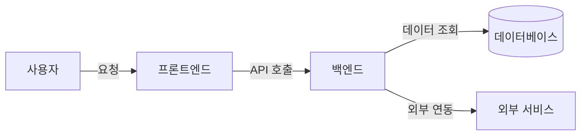
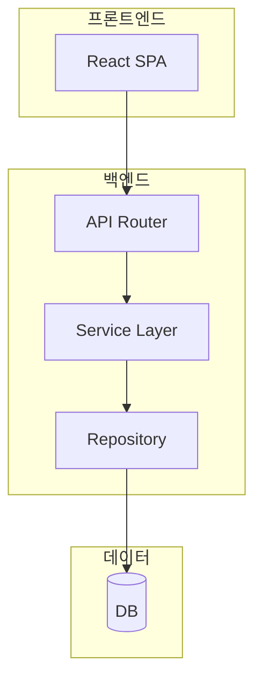

# README 템플릿 (상용 수준)

아래 템플릿을 프로젝트에 맞게 조정해서 사용한다.
`[placeholder]` 부분을 실제 내용으로 교체한다.
해당 없는 섹션은 삭제한다.

---

# [프로젝트명]

[프로젝트가 무엇인지 한 줄 설명]

<!-- 뱃지 (해당 시) -->
<!--  -->
<!--  -->

## 이 프로젝트는 뭔가요?

[중학생도 이해할 수 있게 프로젝트가 하는 일을 설명한다]

**예시**:
> 냉장고에 뭐가 있는지 사진만 찍으면, AI가 재료를 알아보고 만들 수 있는 요리를 추천해주는 서비스입니다.
> 마치 요리사 친구에게 "이거로 뭐 해먹을 수 있어?" 하고 물어보는 것과 같습니다.

## 주요 기능

| 기능 | 설명 |
|:--|:--|
| [기능 1] | [한 줄 설명] |
| [기능 2] | [한 줄 설명] |
| [기능 3] | [한 줄 설명] |

## 스크린샷 / 데모

<!-- 실제 동작 화면 캡처 또는 GIF -->
<!--  -->

[스크린샷이 있으면 여기에 추가]

## 아키텍처



> [한 줄 설명: 전체 흐름을 요약]

<details>
<summary>상세 아키텍처 보기</summary>



</details>

## 기술 스택

| 구분 | 기술 | 버전 | 역할 |
|:--|:--|:--|:--|
| 언어 | [Python/TypeScript] | [3.12/5.x] | [역할] |
| 프론트엔드 | [React/Next.js] | [19.x/15.x] | [역할] |
| 백엔드 | [FastAPI/Express] | [0.115+/4.x] | [역할] |
| DB | [PostgreSQL/SQLite] | [16/3.x] | [역할] |
| 기타 | [Redis/OpenAI] | [7.x/GPT-4o] | [역할] |

## 프로젝트 구조

```
[프로젝트명]/
├── backend/
│   ├── app/
│   │   ├── domain/          # 도메인 모델, 비즈니스 규칙
│   │   ├── usecases/        # 비즈니스 로직 조합
│   │   ├── adapters/        # DB 접근, 외부 API 클라이언트
│   │   ├── api/             # HTTP 라우터
│   │   ├── config.py        # 환경변수 설정
│   │   └── main.py          # 앱 진입점
│   ├── tests/               # 테스트
│   ├── .env.example         # 환경변수 템플릿
│   └── requirements.txt
├── frontend/
│   ├── src/
│   │   ├── components/      # UI 컴포넌트
│   │   ├── hooks/           # 커스텀 훅
│   │   ├── types/           # TypeScript 타입
│   │   └── App.tsx          # 메인 페이지
│   └── package.json
├── docs/                    # 설계 문서, 요구사항
└── README.md
```

## 시작하기

### 필요한 것

- [Python 3.12+](https://python.org)
- [Node.js 18+](https://nodejs.org)
- [필요한 API 키 또는 서비스]

### 1단계: 프로젝트 클론

```bash
git clone [저장소 URL]
cd [프로젝트명]
```

### 2단계: 환경변수 설정

```bash
cp backend/.env.example backend/.env
# .env 파일을 열어서 실제 값을 입력
```

### 3단계: 백엔드 설치 및 실행

```bash
cd backend

# 가상환경 생성
python -m venv venv

# 가상환경 활성화
# Windows:
venv\Scripts\activate
# macOS/Linux:
source venv/bin/activate

# 패키지 설치
pip install -r requirements.txt

# 서버 실행
uvicorn app.main:app --reload
```

서버가 `http://localhost:8000`에서 실행됩니다.
API 문서: `http://localhost:8000/docs`

### 4단계: 프론트엔드 설치 및 실행

```bash
cd frontend
npm install
npm run dev
```

브라우저에서 `http://localhost:5173`을 열면 사용할 수 있습니다.

## 환경변수

| 변수명 | 설명 | 필수 | 기본값 | 예시 |
|:--|:--|:--|:--|:--|
| [VARIABLE_NAME] | [설명] | [O/X] | [있으면] | [예시 값] |

## API 문서

### 주요 엔드포인트

| 메서드 | 경로 | 설명 |
|:--|:--|:--|
| [GET/POST] | [/api/xxx] | [설명] |

자세한 API 문서는 [docs/design/api-spec.md](docs/design/api-spec.md) 또는 [Swagger UI](http://localhost:8000/docs)를 참고하세요.

## 테스트

```bash
# 백엔드 테스트
cd backend && python -m pytest tests/ -v

# 프론트엔드 테스트 (해당 시)
cd frontend && npm test
```

## 문제 해결 (Troubleshooting)

<details>
<summary>서버가 시작되지 않아요</summary>

1. `.env` 파일이 `backend/` 폴더에 있는지 확인
2. 가상환경이 활성화되어 있는지 확인 (`which python`으로 확인)
3. 필수 환경변수가 모두 설정되어 있는지 확인

</details>

<details>
<summary>프론트엔드에서 API 호출이 안 돼요</summary>

1. 백엔드 서버가 실행 중인지 확인 (`http://localhost:8000/api/health`)
2. `vite.config.ts`의 proxy 설정이 올바른지 확인
3. 브라우저 개발자 도구 Network 탭에서 에러 확인

</details>

<details>
<summary>[추가 FAQ]</summary>

[답변]

</details>

## 관련 문서

- [요구사항](docs/requirements.md)
- [아키텍처](docs/architecture.md)
- [데이터 모델](docs/design/data-model.md)
- [API 명세서](docs/design/api-spec.md)
- [기술 결정](docs/design/tech-decisions.md)

## 라이선스

[MIT / Apache 2.0 / 등]
