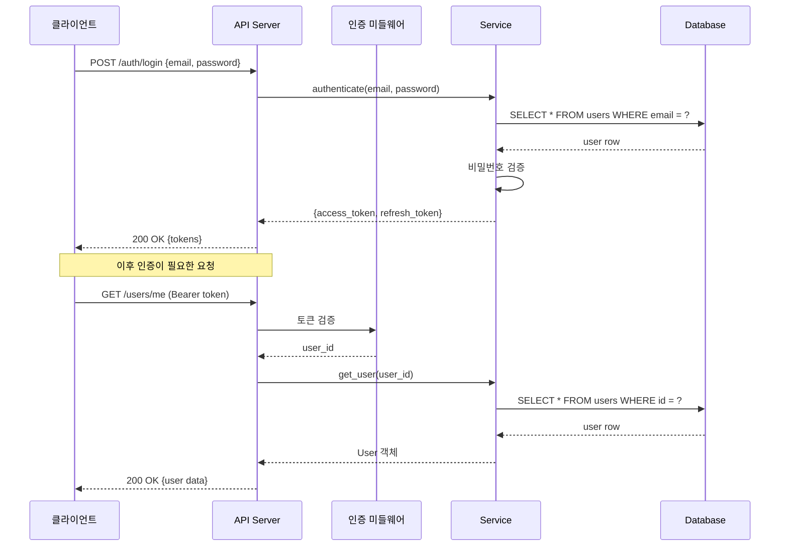

유저와 함께 API를 설계한다.
바로 코드를 작성하지 않고, 명세서를 먼저 완성한다.

## API 설계 프로세스

### 1단계: 리소스 식별

요구사항에서 API로 노출할 리소스를 식별한다.

**질문 순서**:
- "외부에서 접근해야 하는 데이터가 뭔가요?"
- "클라이언트(프론트/모바일)가 어떤 동작을 하나요?"
- "관리자용 API가 별도로 필요한가요?"
- "외부 서비스가 호출하는 API가 있나요?"

#### 리소스 목록 정리

```markdown
## API 리소스

| 리소스 | 설명 | 주요 동작 | 인증 |
|:--|:--|:--|:--|
| /users | 사용자 | 가입, 조회, 수정, 탈퇴 | 필요 |
| /auth | 인증 | 로그인, 토큰 갱신, 로그아웃 | 일부 |
| /orders | 주문 | 생성, 조회, 취소 | 필요 |
| /products | 상품 | 조회, 검색 | 불필요 |
| /admin/users | 관리자-사용자 | 목록, 정지, 삭제 | 관리자 |
```

---

### 2단계: 엔드포인트 설계

각 리소스에 대한 엔드포인트를 설계한다.

#### REST 규칙

| 동작 | HTTP 메서드 | URL 패턴 | 상태 코드 |
|:--|:--|:--|:--|
| 목록 조회 | GET | /resources | 200 |
| 단건 조회 | GET | /resources/:id | 200, 404 |
| 생성 | POST | /resources | 201 |
| 전체 수정 | PUT | /resources/:id | 200, 404 |
| 부분 수정 | PATCH | /resources/:id | 200, 404 |
| 삭제 | DELETE | /resources/:id | 204, 404 |

#### URL 네이밍 규칙

- **복수형** 사용: `/users`, `/orders`, `/products`
- **소문자 + 케밥케이스**: `/order-items`, `/payment-methods`
- **동사 금지**: `/getUsers` ✗ → `/users` ✓
- **중첩은 2단계까지**: `/users/:id/orders` ✓, `/users/:id/orders/:oid/items/:iid` ✗
- **필터는 쿼리 파라미터**: `/orders?status=pending&page=1`
- **행위 엔드포인트**: 리소스 CRUD로 표현 못할 때만 → `/orders/:id/cancel`

#### 엔드포인트 목록 양식

```markdown
## 엔드포인트 목록

### 사용자 (Users)

| 메서드 | 경로 | 설명 | 인증 | 비고 |
|:--|:--|:--|:--|:--|
| POST | /auth/signup | 회원가입 | X | |
| POST | /auth/login | 로그인 | X | 토큰 반환 |
| POST | /auth/refresh | 토큰 갱신 | O | refresh token |
| GET | /users/me | 내 정보 조회 | O | |
| PATCH | /users/me | 내 정보 수정 | O | |
| DELETE | /users/me | 회원 탈퇴 | O | 소프트 삭제 |

### 주문 (Orders)

| 메서드 | 경로 | 설명 | 인증 | 비고 |
|:--|:--|:--|:--|:--|
| POST | /orders | 주문 생성 | O | |
| GET | /orders | 내 주문 목록 | O | 페이지네이션 |
| GET | /orders/:id | 주문 상세 | O | 본인 주문만 |
| POST | /orders/:id/cancel | 주문 취소 | O | 상태 변경 |
```

---

### 3단계: 요청/응답 스키마

각 엔드포인트의 요청과 응답 형식을 정의한다.

#### 요청 스키마 양식

```markdown
### POST /auth/signup

**요청**

| 필드 | 타입 | 필수 | 검증 | 설명 |
|:--|:--|:--|:--|:--|
| email | string | O | 이메일 형식, 최대 255자 | 사용자 이메일 |
| password | string | O | 최소 8자, 영문+숫자+특수문자 | 비밀번호 |
| name | string | O | 최소 2자, 최대 50자 | 이름 |
| phone | string | X | 010-XXXX-XXXX 형식 | 전화번호 |

요청 예시:
```json
{
  "email": "user@example.com",
  "password": "Str0ng!Pass",
  "name": "홍길동",
  "phone": "010-1234-5678"
}
```
```

#### 응답 스키마 양식

```markdown
**성공 응답** (201 Created)

| 필드 | 타입 | 설명 |
|:--|:--|:--|
| id | integer | 사용자 ID |
| email | string | 이메일 |
| name | string | 이름 |
| created_at | string (ISO 8601) | 가입일 |

```json
{
  "id": 1,
  "email": "user@example.com",
  "name": "홍길동",
  "created_at": "2026-04-04T09:00:00Z"
}
```

**에러 응답** (409 Conflict)
```json
{
  "error": {
    "code": "EMAIL_ALREADY_EXISTS",
    "message": "이미 등록된 이메일입니다."
  }
}
```
```

#### 응답에 절대 포함하지 않는 것

- password, password_hash
- 내부 서버 에러 스택 트레이스
- 다른 사용자의 민감 정보
- DB 내부 구조가 노출되는 필드명 (internal_flag 등)

---

### 4단계: 공통 설계

#### 페이지네이션

```markdown
### 페이지네이션 (목록 조회 공통)

**요청 파라미터**

| 파라미터 | 타입 | 기본값 | 설명 |
|:--|:--|:--|:--|
| page | integer | 1 | 페이지 번호 (1부터) |
| size | integer | 20 | 페이지당 항목 수 (최대 100) |
| sort | string | created_at | 정렬 기준 필드 |
| order | string | desc | 정렬 방향 (asc/desc) |

**응답 형식**

```json
{
  "data": [...],
  "pagination": {
    "page": 1,
    "size": 20,
    "total_count": 150,
    "total_pages": 8,
    "has_next": true,
    "has_prev": false
  }
}
```
```

#### 인증

```markdown
### 인증 방식

**JWT Bearer Token**

| 헤더 | 값 |
|:--|:--|
| Authorization | Bearer {access_token} |

**토큰 종류**

| 토큰 | 만료 | 용도 |
|:--|:--|:--|
| access_token | 30분 | API 요청 인증 |
| refresh_token | 14일 | access_token 갱신 |
```

#### 에러 응답 표준

```markdown
### 에러 응답 형식

모든 에러는 아래 형식을 따른다:

```json
{
  "error": {
    "code": "ERROR_CODE",
    "message": "사용자에게 보여줄 메시지",
    "details": [...]  // 선택, 필드별 검증 에러 시
  }
}
```

### 공통 에러 코드

| HTTP | 에러 코드 | 설명 | 사용 시점 |
|:--|:--|:--|:--|
| 400 | VALIDATION_ERROR | 입력값 검증 실패 | 필드 형식, 범위, 길이 |
| 400 | INVALID_REQUEST | 잘못된 요청 | 비즈니스 규칙 위반 |
| 401 | UNAUTHORIZED | 인증 필요 | 토큰 없음 |
| 401 | TOKEN_EXPIRED | 토큰 만료 | access_token 만료 |
| 403 | FORBIDDEN | 권한 없음 | 본인/관리자만 접근 가능 |
| 404 | NOT_FOUND | 리소스 없음 | 존재하지 않는 ID |
| 409 | CONFLICT | 충돌 | 이메일 중복 등 |
| 422 | UNPROCESSABLE | 처리 불가 | 논리적으로 처리 불가 |
| 429 | RATE_LIMITED | 요청 초과 | API 호출 제한 |
| 500 | INTERNAL_ERROR | 서버 에러 | 예상치 못한 에러 |

### 검증 에러 상세 (400)

```json
{
  "error": {
    "code": "VALIDATION_ERROR",
    "message": "입력값을 확인해주세요.",
    "details": [
      {
        "field": "email",
        "message": "이메일 형식이 올바르지 않습니다."
      },
      {
        "field": "password",
        "message": "비밀번호는 8자 이상이어야 합니다."
      }
    ]
  }
}
```
```

#### API 버전 관리

```markdown
### 버전 관리

- URL 접두사 방식: `/api/v1/users`, `/api/v2/users`
- 하위 호환: 기존 필드 제거 금지, 추가만 가능
- 버전 변경 기준: 기존 응답 구조가 바뀔 때만
```

---

### 5단계: API 흐름 다이어그램

주요 흐름을 Mermaid sequenceDiagram으로 작성한다.



---

## 산출물 저장 위치

| 산출물 | 위치 |
|:--|:--|
| API 명세서 | `docs/design/api-spec.md` |
| 흐름 다이어그램 | API 명세서 내에 포함 |

---

## API 설계 체크리스트

설계 완료 전 아래를 확인한다:

- [ ] 모든 엔드포인트에 HTTP 메서드가 적절한가
- [ ] URL이 REST 규칙을 따르는가 (복수형, 소문자, 동사 없음)
- [ ] 모든 요청 필드에 타입, 필수 여부, 검증 규칙이 있는가
- [ ] 모든 응답에 성공/에러 예시가 있는가
- [ ] 인증이 필요한 엔드포인트가 명시되어 있는가
- [ ] 페이지네이션이 필요한 목록 API에 적용되어 있는가
- [ ] 에러 코드가 일관적인가
- [ ] API와 데이터 모델이 일치하는가
- [ ] 민감 정보가 응답에 노출되지 않는가
- [ ] 주요 흐름에 시퀀스 다이어그램이 있는가

## 원칙

- 유저와 대화하면서 점진적으로 설계한다
- 명세서가 코드보다 먼저다 — 명세를 보고 프론트/백엔드가 동시에 개발할 수 있어야 한다
- 일관성이 가장 중요하다 — 한 곳에서 정한 규칙은 모든 엔드포인트에 적용
- 프론트엔드 개발자 관점에서 사용하기 편한 API를 설계한다
- 불확실한 내용은 "[확인 필요]"로 표시한다
