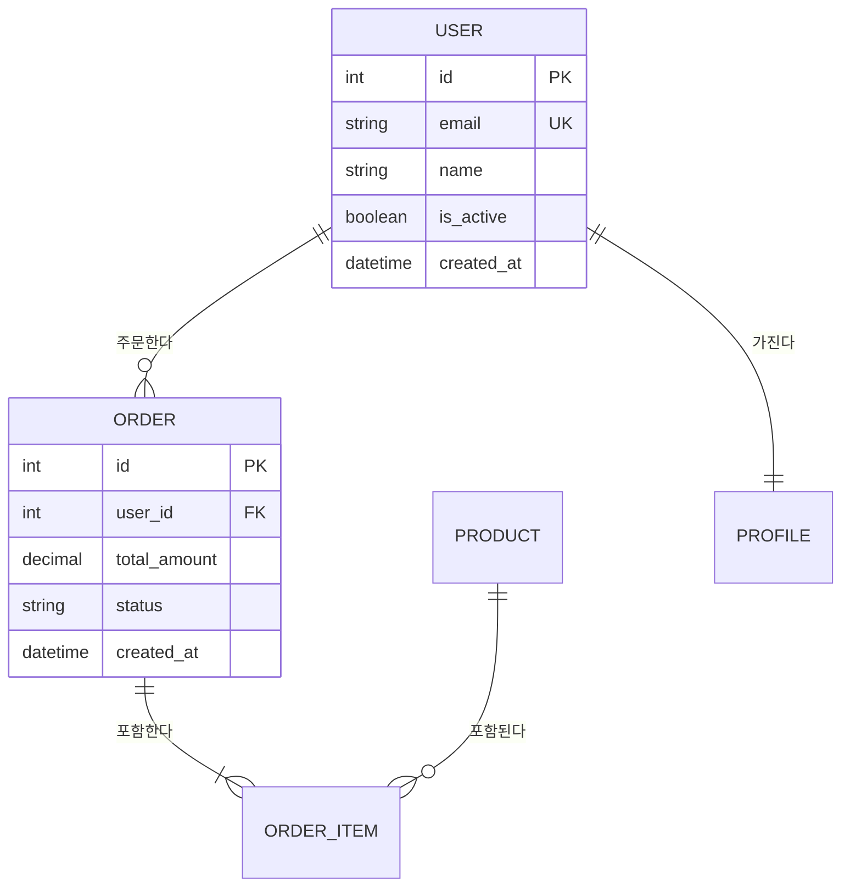

유저와 함께 데이터 모델링을 진행한다.
바로 테이블을 만들지 않고, 도메인 분석부터 시작해서 단계별로 설계한다.

## 데이터 모델링 프로세스

### 1단계: 도메인 분석

유저의 요구사항에서 핵심 도메인 객체를 추출한다.

**질문 순서**:

1차 질문 (핵심 객체 파악):
- "이 서비스에서 가장 중요한 데이터가 뭔가요?"
- "사용자가 만들거나 관리하는 것이 뭔가요?"
- "돈이 오가는 흐름이 있나요?"

2차 질문 (관계 파악):
- "A와 B는 어떤 관계인가요? (1:1, 1:N, N:M)"
- "A 없이 B가 존재할 수 있나요?"
- "이 데이터는 누가 만들고 누가 조회하나요?"

3차 질문 (상세 속성):
- "A에 반드시 들어가야 할 정보는?"
- "나중에 검색/필터링이 필요한 필드가 있나요?"
- "시간에 따라 변하는 데이터가 있나요? (이력 관리)"

#### 도메인 객체 정리 양식

```markdown
## 도메인 객체

| 객체 | 설명 | 주요 속성 | 비고 |
|:--|:--|:--|:--|
| User | 서비스 사용자 | 이메일, 이름, 비밀번호 | 인증 주체 |
| Order | 주문 | 금액, 상태, 날짜 | User가 생성 |
| Product | 상품 | 이름, 가격, 재고 | Order에 포함 |
```

---

### 2단계: 개념적 모델링 (Conceptual)

도메인 객체 간의 관계를 정의한다. 아직 DB 테이블이 아닌 **개념** 수준이다.

#### 관계 유형 정리

| 관계 | 설명 | 예시 |
|:--|:--|:--|
| 1:1 | 하나가 정확히 하나 | User ↔ Profile |
| 1:N | 하나가 여러 개 | User → Orders |
| N:M | 여러 개가 여러 개 | Student ↔ Course |
| 자기참조 | 자기 자신을 참조 | Employee → Manager(Employee) |
| 상속 | 공통 속성 공유 | Payment → CardPayment, BankPayment |

#### ERD 작성 (Mermaid erDiagram)



#### ERD 작성 규칙

- 모든 테이블에 PK를 명시한다
- FK 관계를 화살표로 표현한다
- 관계 라벨에 동사를 사용한다 ("주문한다", "포함된다")
- 주요 속성만 ERD에 포함한다 (전체 속성은 스키마에서)
- 관계 표기법:

| 기호 | 의미 |
|:--|:--|
| `\|\|--\|\|` | 1:1 (양쪽 필수) |
| `\|\|--o{` | 1:N (N쪽 선택) |
| `\|\|--\|{` | 1:N (N쪽 필수) |
| `}o--o{` | N:M (양쪽 선택) |

---

### 3단계: 논리적 모델링 (Logical)

개념적 모델을 실제 테이블 구조로 변환한다.

#### 정규화 체크리스트

**제1정규형 (1NF)**:
- [ ] 모든 컬럼이 원자값인가? (배열, JSON이 아닌 단일 값)
- [ ] 반복 그룹이 없는가? (phone1, phone2, phone3 → 별도 테이블)

**제2정규형 (2NF)**:
- [ ] 복합 PK가 있을 때, 모든 비키 속성이 전체 PK에 종속되는가?
- [ ] 부분 종속이 있으면 별도 테이블로 분리했는가?

**제3정규형 (3NF)**:
- [ ] 비키 속성이 다른 비키 속성에 종속되지 않는가?
- [ ] 예: order에 user_name이 있으면 → user 테이블에서 JOIN

**실무 판단**:
- 성능을 위해 의도적으로 비정규화하는 경우 이유를 명시한다
- 읽기 빈도가 극히 높고 JOIN 비용이 큰 경우 비정규화 고려
- 비정규화 시 데이터 정합성 유지 방안을 함께 명시한다

#### 테이블 스키마 양식

```markdown
### [테이블명] 테이블

**설명**: [이 테이블의 역할]

| 컬럼 | 타입 | 제약조건 | 기본값 | 설명 |
|:--|:--|:--|:--|:--|
| id | BIGINT | PK, AUTO_INCREMENT | - | 고유 식별자 |
| email | VARCHAR(255) | UNIQUE, NOT NULL | - | 이메일 |
| name | VARCHAR(100) | NOT NULL | - | 이름 |
| is_active | BOOLEAN | NOT NULL | true | 활성 여부 |
| created_at | TIMESTAMP | NOT NULL | CURRENT_TIMESTAMP | 생성일 |
| updated_at | TIMESTAMP | NOT NULL | CURRENT_TIMESTAMP | 수정일 |
| deleted_at | TIMESTAMP | NULL | NULL | 삭제일 (소프트 삭제) |
```

#### 데이터 타입 선택 가이드

| 데이터 | 권장 타입 | 주의 |
|:--|:--|:--|
| 고유 ID | BIGINT 또는 UUID | UUID는 정렬 불가, BIGINT이 성능 유리 |
| 금액 | DECIMAL(10,2) | FLOAT/DOUBLE 금지 (소수점 오차) |
| 이메일 | VARCHAR(255) | RFC 기준 최대 254자 |
| 비밀번호 해시 | VARCHAR(255) | bcrypt 기준 60자이나 여유 확보 |
| 상태값 | VARCHAR(20) 또는 ENUM | ENUM은 변경 비용 큼, VARCHAR 권장 |
| 날짜 | TIMESTAMP | TIMEZONE 포함 여부 확인 |
| 긴 텍스트 | TEXT | 인덱스 불가, 검색 필요 시 별도 방안 |
| JSON | JSONB (PostgreSQL) | 쿼리 가능하지만 스키마 검증 불가 |
| boolean | BOOLEAN | NOT NULL + 기본값 필수 |

---

### 4단계: 물리적 모델링 (Physical)

실제 DB에 최적화된 설계.

#### 인덱스 설계

**인덱스를 만들어야 하는 경우**:
- WHERE 절에 자주 사용되는 컬럼
- JOIN 조건에 사용되는 FK 컬럼
- ORDER BY에 자주 사용되는 컬럼
- UNIQUE 제약이 필요한 컬럼

**인덱스를 만들면 안 되는 경우**:
- 카디널리티가 낮은 컬럼 (boolean, status 등 값 종류가 적은 것)
- 자주 UPDATE되는 컬럼 (인덱스 갱신 비용)
- 테이블 크기가 매우 작은 경우

```markdown
### 인덱스 설계

| 테이블 | 인덱스명 | 컬럼 | 종류 | 이유 |
|:--|:--|:--|:--|:--|
| users | idx_users_email | email | UNIQUE | 로그인 시 이메일 조회 |
| orders | idx_orders_user_id | user_id | INDEX | 사용자별 주문 조회 |
| orders | idx_orders_status_created | status, created_at | COMPOSITE | 상태별 최신순 조회 |
```

#### 제약조건 설계

```markdown
### 제약조건

| 테이블 | 제약조건 | 종류 | 설명 |
|:--|:--|:--|:--|
| users | uk_users_email | UNIQUE | 이메일 중복 방지 |
| orders | fk_orders_user_id | FK | users.id 참조, CASCADE DELETE |
| orders | ck_orders_amount | CHECK | amount >= 0 |
```

#### 소프트 삭제 vs 하드 삭제

| 방식 | 장점 | 단점 | 사용 시점 |
|:--|:--|:--|:--|
| 소프트 삭제 (deleted_at) | 복구 가능, 감사 추적 | 쿼리마다 WHERE 조건 필요 | 사용자 데이터, 주문 |
| 하드 삭제 (DELETE) | 단순, 저장 공간 절약 | 복구 불가 | 임시 데이터, 로그 |

---

### 5단계: 마이그레이션 SQL 생성

설계가 확정되면 마이그레이션 SQL을 생성한다.

```sql
-- 마이그레이션: [설명]
-- 날짜: [YYYY-MM-DD]

CREATE TABLE users (
    id BIGSERIAL PRIMARY KEY,
    email VARCHAR(255) UNIQUE NOT NULL,
    name VARCHAR(100) NOT NULL,
    password_hash VARCHAR(255) NOT NULL,
    is_active BOOLEAN NOT NULL DEFAULT true,
    created_at TIMESTAMP NOT NULL DEFAULT CURRENT_TIMESTAMP,
    updated_at TIMESTAMP NOT NULL DEFAULT CURRENT_TIMESTAMP,
    deleted_at TIMESTAMP NULL
);

CREATE INDEX idx_users_email ON users (email);

-- 롤백
-- DROP TABLE IF EXISTS users;
```

---

## 산출물 저장 위치

| 산출물 | 위치 |
|:--|:--|
| ERD + 스키마 정의 | `docs/design/data-model.md` |
| 마이그레이션 SQL | `backend/migrations/` 또는 `db/migrations/` |

---

## 원칙

- 유저와 대화하면서 점진적으로 설계한다
- 한 번에 완벽한 설계를 목표로 하지 않는다 — 나선형으로 반복
- 정규화를 기본으로 하되, 성능을 위한 비정규화는 이유를 명시한다
- 실제로 필요한 테이블만 만든다 — "나중에 쓸 수도 있으니까"는 금지
- 불확실한 내용은 "[확인 필요]"로 표시한다
- 설계 결정에는 반드시 이유를 함께 적는다
