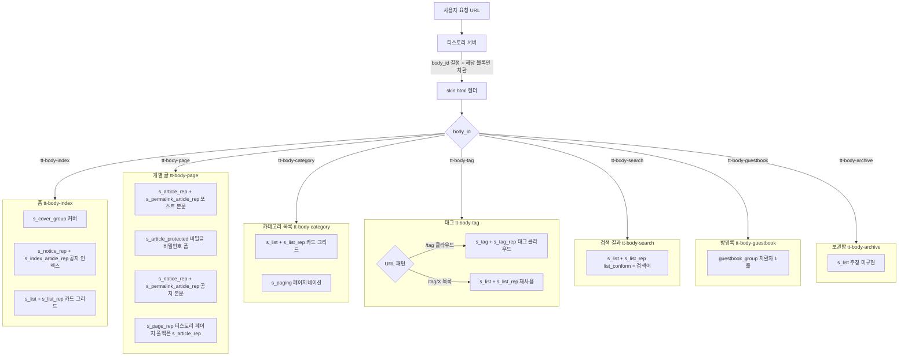

# 페이지 분기 플로우 다이어그램

- 출처: `skin-architecture.md §2.2` 를 독립 파일로 추출 + 보조 설명 추가
- 근거: `tistory-skin-spec.md §2.1~2.3`

티스토리 서버는 URL을 기준으로 `body_id` 를 결정하고, 해당 body_id 에 맞는 조건부 블록만 치환해 `skin.html` 을 렌더한다. 나머지 조건부 블록은 빈 문자열로 치환되어 HTML에 남지 않는다.

`tt-body-tag` 는 `/tag` (클라우드 페이지)와 `/tag/{태그명}` (목록 페이지) 모두에서 동일하게 할당된다. 두 경우를 body_id 로는 구분할 수 없으며, 어떤 블록(`<s_tag>` vs `<s_list>`)이 실제로 활성화되는지는 실제 환경에서 확인이 필요하다.

## 주요 분기 규칙 (구현 시 필독)

| 규칙 | 설명 |
|:--|:--|
| `<s_article_rep>` 내부 분기 | `<s_permalink_article_rep>` = permalink 전용, `<s_index_article_rep>` = 목록(홈) 전용 |
| `<s_notice_rep>` 내부 분기 | 글 블록과 동일 패턴. **단 한 번만 선언하고 내부에서 분기** |
| `<s_page_rep>` 폴백 | `<s_page_rep>` 미선언 시 `<s_article_rep>` 가 대신 렌더됨 |
| `tt-body-tag` 공유 | `/tag` 와 `/tag/X` 모두 같은 body_id. `<s_tag>` 와 `<s_list>` 중 어떤 것이 활성화되는지 실제 확인 필요 |
| CSS 분기 | `body#tt-body-index .profile-hero { display: block }` 처럼 body_id 기준으로 CSS 분기 |
