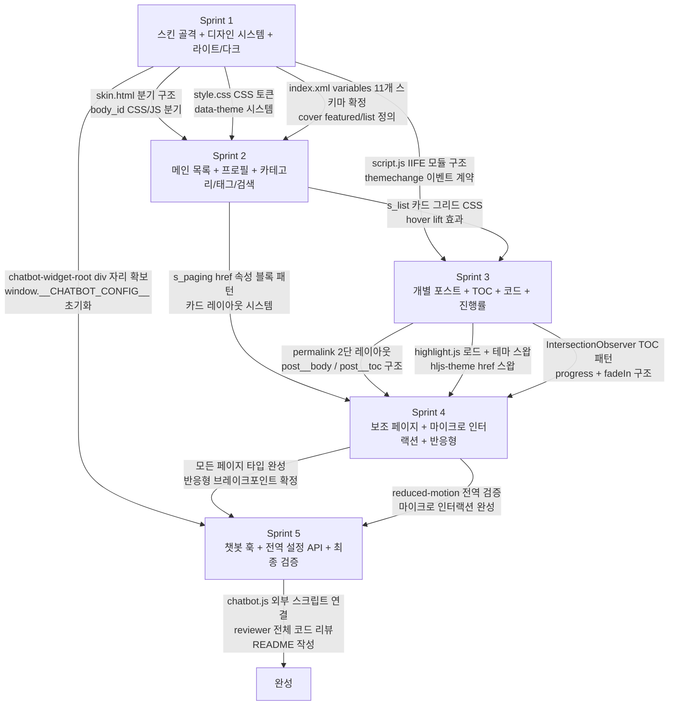

# 스프린트 의존성 그래프

- 신규 작성
- 근거: `sprint-plan.md` 전체, `tech-decisions.md`, `skin-architecture.md`

각 스프린트가 이전 스프린트의 어떤 산출물에 의존하는지 보여준다. Sprint 1 의 `index.xml`(`<variables>`, `<cover>`)과 `skin.html` 의 분기 구조는 이후 모든 스프린트의 기반이므로, Sprint 1 에서 스키마를 확정하지 않으면 이후 `index.xml` 수정 시 사용자 설정 초기화 위험이 발생한다.

## 의존성 상세 (Sprint 1 산출물이 이후에 미치는 영향)

| Sprint 1 산출물 | 의존하는 스프린트 | 비고 |
|:--|:--|:--|
| `index.xml` `<variables>` 11개 스키마 | 2~5 전체 | 수정 시 사용자 설정 초기화. **Sprint 1에서 확정 필수** |
| `index.xml` `<cover>` `featured`/`list` | Sprint 2 (홈 커버 구현) | `<s_cover name="...">` 와 반드시 일치 |
| `skin.html` body_id 분기 구조 | 2~5 전체 | 모든 페이지 블록의 위치가 Sprint 1 골격에 기반 |
| `style.css` `:root` CSS 토큰 | 2~5 전체 | 모든 컴포넌트가 이 토큰 참조 |
| `[data-theme]` 시스템 + `themechange` 이벤트 | Sprint 3 (hljs 스왑), Sprint 5 (챗봇 테마 동기화) | 이벤트 이름/detail 형식 변경 불가 |
| `#chatbot-widget-root` div | Sprint 5 (챗봇 위젯 마운트) | Sprint 1부터 존재해야 외부 스크립트가 항상 찾을 수 있음 |
| `window.__CHATBOT_CONFIG__` 초기화 스텁 | Sprint 5 (챗봇 통합) | 객체 구조 변경 시 외부 스크립트와 계약 파기 |

## 임계 경로 (Critical Path)

Sprint 1 → Sprint 2 → Sprint 3 → Sprint 4 → Sprint 5 순서가 고정이며, 각 스프린트는 이전 스프린트 완료 기준을 통과해야 다음을 시작할 수 있다. Sprint 4 와 Sprint 5 일부 작업은 병렬 진행 가능하다(챗봇 API 계약 문서 `chatbot-integration.md` 는 Sprint 4 와 동시 작업 가능).
