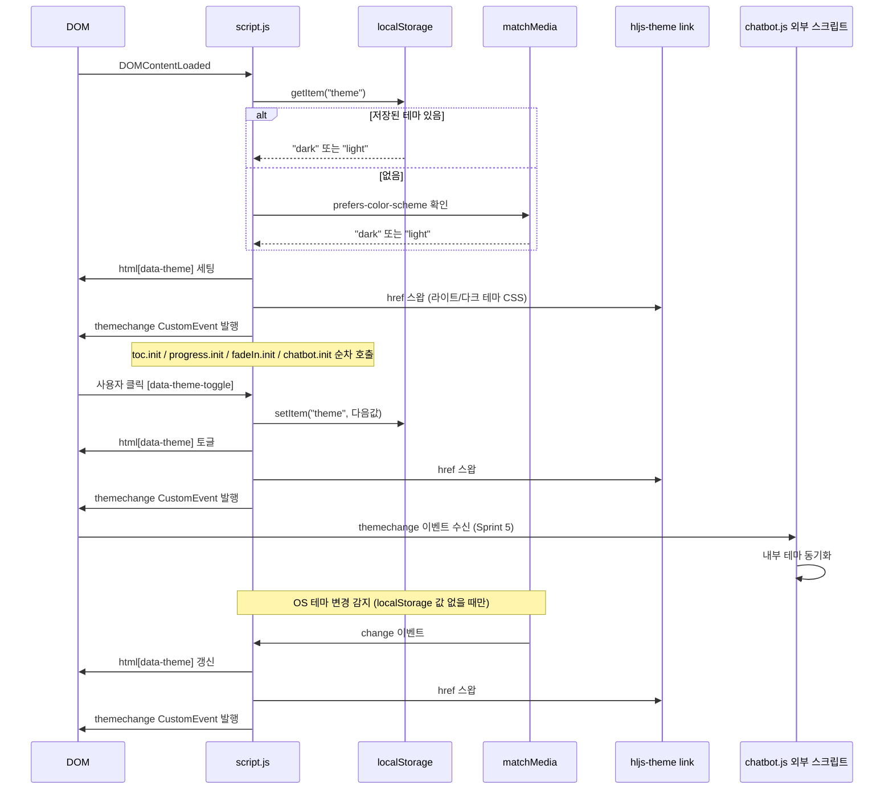

# 테마 초기화 시퀀스 다이어그램

- 출처: `skin-architecture.md §5.3` 를 독립 파일로 추출 + 설명 추가
- 구현 대상: Sprint 1 `images/script.js` 테마 모듈

페이지 로드 시 `script.js` 가 `DOMContentLoaded` 이벤트를 받아 테마를 초기화하는 흐름을 보여준다. localStorage에 저장된 값이 있으면 우선 적용하고, 없으면 OS 의 `prefers-color-scheme` 를 읽어 적용한다. 테마 전환 시 `hljs-theme` CSS 링크의 href 를 스왑해 코드 하이라이팅 테마도 동기화한다.

테마 변경이 일어날 때마다 `themechange` CustomEvent 를 발행하며, Sprint 5 챗봇 모듈은 이 이벤트를 listen해 내부 테마를 동기화한다.

## 구현 체크포인트 (Sprint 1)

| 체크 항목 | 확인 방법 |
|:--|:--|
| localStorage 우선 적용 | 토글 후 새로고침 시 같은 테마 유지 |
| OS 감지 초기 적용 | localStorage 비운 뒤 OS 다크모드 켜고 접속 |
| OS 변경 실시간 반영 | localStorage 비운 뒤 OS 테마 변경 시 즉시 전환 |
| localStorage 있을 때 OS 무시 | localStorage `light` 세팅 후 OS 다크 변경 → light 유지 |
| hljs-theme CSS 스왑 | Network 탭에서 테마 전환 시 CSS href 변경 확인 |
| themechange 이벤트 | 브라우저 콘솔에서 이벤트 발행 확인 |
