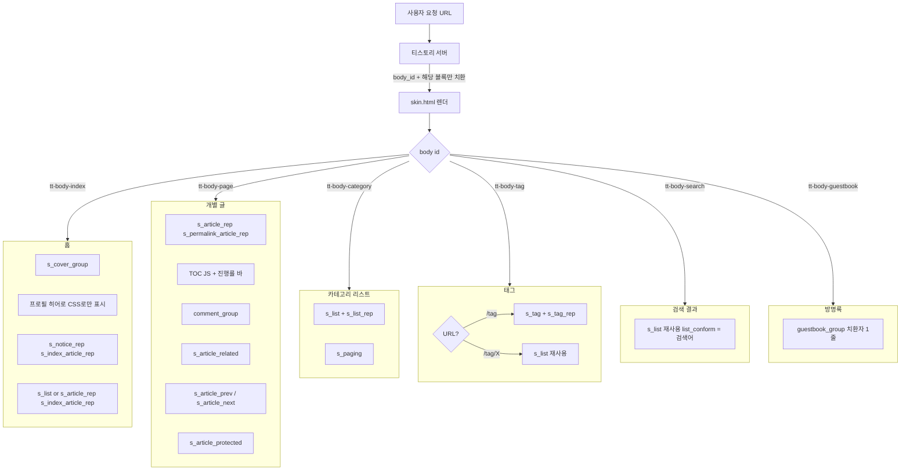
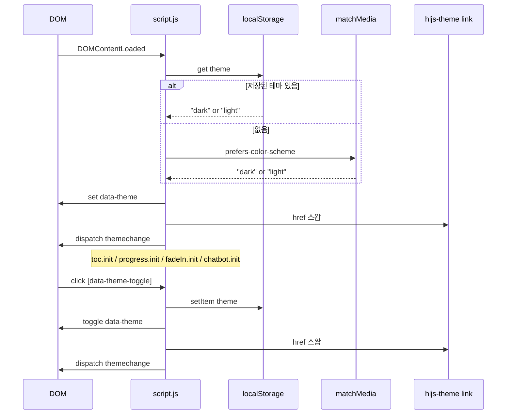

# 스킨 아키텍처 (Skin Architecture)

- 작성일: 2026-04-19
- 근거: [tistory-skin-spec.md](tistory-skin-spec.md), [tech-decisions.md](tech-decisions.md)

---

## 1. 파일 구조

```
SKIN_ROOT/
├── index.xml              # 스킨 메타 + <variables> + <cover> 정의
├── skin.html              # 전 페이지 템플릿 (body_id + 조건부 블록 분기)
├── style.css              # 단일 CSS (토큰 + 레이아웃 + 컴포넌트)
├── preview.gif            # 112x84 fallback (Sprint 5에 실제 미리보기)
├── preview256.jpg         # 256x192
├── preview560.jpg         # 560x420
├── preview1600.jpg        # 1600x1200
└── images/
    ├── script.js          # 메인 JS (테마 · TOC · 진행률 · 페이드인 · 챗봇 훅)
    └── chatbot-stub.js    # Sprint 5 옵션 스텁
```

**원칙**
- `images/` 외 경로는 티스토리가 허용하지 않음
- 에디터 편집성 우선 → CSS/JS 분리 최소화

---

## 2. 페이지 분기 맵

### 2.1 body_id 기준 (공식 규격)

| 페이지 | body_id | 활성 조건부 블록 | 참고 |
|:--|:--|:--|:--|
| 홈 | `tt-body-index` | `<s_cover_group>`, `<s_list>`, `<s_notice_rep><s_index_article_rep>` | 홈은 `<s_cover_group>` + `<s_list>` 조합으로 통일. `<s_index_article_rep>` 는 쓰지 않음 |
| 개별 글 | `tt-body-page` | `<s_article_rep><s_permalink_article_rep>`, `<s_notice_rep><s_permalink_article_rep>`, `<s_article_protected>`, `<s_page_rep>` | 비밀글은 protected만 |
| 카테고리 리스트 | `tt-body-category` | `<s_list>` + `<s_list_rep>` | `[##_list_conform_##]` = 카테고리명 |
| 태그 클라우드 | `tt-body-tag` (URL `/tag`) | `<s_tag>` + `<s_tag_rep>` | `[##_tag_class_##]` cloud1~5. U-2 확인 필요 |
| 태그별 목록 | `tt-body-tag` (URL `/tag/X`) | `<s_list>` + `<s_list_rep>` | 태그 클라우드와 body_id 동일 → CSS 분기 불가. JS로 `location.pathname` 기반 분기 필요 (Sprint 2에서) |
| 검색 결과 | `tt-body-search` | `<s_list>` + `<s_list_rep>` | `[##_list_conform_##]` = 검색어 |
| 방명록 | `tt-body-guestbook` | `[##_guestbook_group_##]` 또는 `<s_guest>` | 현행: 치환자 1줄 |
| 보관함 | `tt-body-archive` | `<s_list>` 추정 | Ray 테마 미사용 |
| 지역로그 | `tt-body-location` | — | 사용 안 함 (범위 외) |

### 2.2 페이지 분기 다이어그램 (Mermaid)



### 2.3 단일 skin.html 내 배치 전략

- 모든 페이지 블록을 `<main class="site-main">` 안에 **순차적으로 나열**
- 티스토리가 현재 페이지에 해당하지 않는 조건부 블록은 **빈 문자열로 치환** → HTML에는 남지 않음
- 따라서 CSS는 `body#tt-body-index .profile-hero { display: block }` 처럼 **body id 기준으로 분기**
- 프로필 히어로처럼 조건부 블록이 아닌 정적 섹션도 `body#tt-body-index` 한정으로 CSS 표시

---

## 3. skin.html 상위 구조 (의사 코드)

```html
<!DOCTYPE html>
<html lang="ko" data-theme="light">
<head>
  <meta charset="UTF-8" />
  <meta name="viewport" content="width=device-width, initial-scale=1.0, viewport-fit=cover" />
  <title>[##_page_title_##]</title>
  <meta name="description" content="[##_desc_##]" />
  <meta property="og:title" content="[##_page_title_##]" />
  <meta property="og:description" content="[##_desc_##]" />
  <meta property="og:image" content="[##_image_##]" />
  <meta property="og:site_name" content="[##_title_##]" />
  <link rel="alternate" type="application/rss+xml" title="[##_title_##]" href="[##_rss_url_##]" />

  <link rel="stylesheet" href="https://cdn.jsdelivr.net/gh/orioncactus/pretendard@v1.3.9/dist/web/variable/pretendardvariable-dynamic-subset.css" />
  <link rel="stylesheet" href="https://cdn.jsdelivr.net/npm/@fontsource/jetbrains-mono@5.0.0/index.css" />
  <link id="hljs-theme" rel="stylesheet" href="https://cdn.jsdelivr.net/gh/highlightjs/cdn-release@11/build/styles/github.min.css" />
  <link rel="stylesheet" href="./style.css" />
</head>
<body id="[##_body_id_##]">
  <s_t3>

    <!-- 진행률 바 (전 페이지, BOOL 조건부) -->
    <s_if_var_show-reading-progress>
      <div class="reading-progress" data-reading-progress aria-hidden="true"></div>
    </s_if_var_show-reading-progress>

    <!-- 헤더 -->
    <header class="site-header">
      <a class="site-logo" href="[##_blog_link_##]">[##_title_##]</a>
      <nav class="site-nav" aria-label="카테고리">[##_category_list_##]</nav>
      <s_search>
        <form class="site-search" role="search">
          <input type="text" name="[##_search_name_##]" value="[##_search_text_##]"
                 placeholder="검색..."
                 onkeypress="if(event.keyCode==13){[##_search_onclick_submit_##]}"
                 aria-label="검색" />
          <button type="button" class="site-search__submit"
                  onclick="[##_search_onclick_submit_##]"
                  aria-label="검색 실행">
            <!-- inline SVG 돋보기 아이콘 -->
          </button>
        </form>
      </s_search>
      <button class="theme-toggle" data-theme-toggle aria-label="라이트/다크 전환" type="button">
        <!-- inline SVG 해/달 아이콘 (CSS로 테마별 표시) -->
      </button>
    </header>

    <main class="site-main">

      <!-- [홈] 프로필 히어로: CSS로 body#tt-body-index 에만 표시 -->
      <section class="profile-hero">
        <s_if_var_profile-image>
          
        </s_if_var_profile-image>
        <h1 class="profile-hero__name">
          <s_if_var_profile-name>[##_var_profile-name_##]</s_if_var_profile-name>
          <s_not_var_profile-name>[##_blogger_##]</s_not_var_profile-name>
        </h1>
        <p class="profile-hero__tagline">
          <s_if_var_profile-tagline>[##_var_profile-tagline_##]</s_if_var_profile-tagline>
          <s_not_var_profile-tagline>[##_desc_##]</s_not_var_profile-tagline>
        </p>
        <div class="profile-hero__links">
          <s_if_var_profile-link-github>
            <a href="[##_var_profile-link-github_##]" target="_blank" rel="noopener">GitHub</a>
          </s_if_var_profile-link-github>
          <s_if_var_profile-link-linkedin>
            <a href="[##_var_profile-link-linkedin_##]" target="_blank" rel="noopener">LinkedIn</a>
          </s_if_var_profile-link-linkedin>
          <s_if_var_profile-link-email>
            <a href="mailto:[##_var_profile-link-email_##]">Email</a>
          </s_if_var_profile-link-email>
        </div>
      </section>

      <!-- [홈] 커버 (Sprint 2) — Sprint 2 착수 전 Ray 테마 skin.html(출처 27)로 실제 패턴 재확인 필요 (U-1) -->
      <!-- 현재 잠정안: <s_cover_group> 직하에 <s_cover name="..."> 나열 (반복 없이 이름별 선언) -->
      <s_cover_group>
        <s_cover name="featured">…</s_cover>
        <s_cover name="list">…</s_cover>
      </s_cover_group>

      <!-- [홈 인덱스 + 공지 permalink 공용] 공지 블록 (Sprint 4)
           <s_notice_rep>는 단 한 번만 선언하고 내부에서 permalink/index를 분기한다
           (공식 규격 §2.3 규칙 3, <s_article_rep>와 동일 패턴) -->
      <s_notice_rep>
        <s_index_article_rep>
          <!-- 홈(tt-body-index) 상단 공지 리스트 -->
          …
        </s_index_article_rep>
        <s_permalink_article_rep>
          <!-- 공지 permalink 본문 -->
          …
        </s_permalink_article_rep>
      </s_notice_rep>

      <!-- [홈/카테고리/태그별/검색] 카드 리스트 (Sprint 2) -->
      <s_list>
        <s_list_empty>…</s_list_empty>
        <ul class="card-grid">
          <s_list_rep>
            <li class="card">…</li>
          </s_list_rep>
        </ul>
        <s_paging>…</s_paging>
      </s_list>

      <!-- [개별글 permalink] (Sprint 3) -->
      <s_article_rep>
        <s_permalink_article_rep>
          <article class="post">
            <header class="post__head">…</header>
            <div class="post__layout">
              <div class="post__body" data-post-body>[##_article_rep_desc_##]</div>
              <aside class="post__toc" data-toc></aside>
            </div>
            <s_tag_label><div class="post__tags">[##_tag_label_rep_##]</div></s_tag_label>
            <s_article_related>…</s_article_related>
            <nav class="post__siblings">
              <s_article_prev>…</s_article_prev>
              <s_article_next>…</s_article_next>
            </nav>
            <section class="post__comments">[##_comment_group_##]</section>
          </article>
        </s_permalink_article_rep>
      </s_article_rep>

      <!-- [보호글] (Sprint 4) -->
      <s_article_protected>…</s_article_protected>

      <!-- [태그 클라우드] (Sprint 2) -->
      <s_tag>
        <section class="tag-cloud">
          <s_tag_rep>
            <a class="tag-cloud__item [##_tag_class_##]" href="[##_tag_link_##]">[##_tag_name_##]</a>
          </s_tag_rep>
        </section>
      </s_tag>

      <!-- [방명록] (Sprint 4) -->
      <section class="guestbook">[##_guestbook_group_##]</section>

    </main>

    <!-- 사이드바 (데스크톱에만 CSS 표시) -->
    <s_sidebar>
      <s_sidebar_element>
        <!-- 최근 글 -->
        <section class="sidebar-block"><h3>최근 글</h3>
          <ul>
            <s_rctps_rep>
              <li><a href="[##_rctps_rep_link_##]">[##_rctps_rep_title_##]</a></li>
            </s_rctps_rep>
          </ul>
        </section>
      </s_sidebar_element>
      <s_sidebar_element>
        <!-- 태그 -->
        <section class="sidebar-block"><h3>태그</h3>
          <div class="sidebar-tags">
            <s_random_tags>
              <a class="[##_tag_class_##]" href="[##_tag_link_##]">[##_tag_name_##]</a>
            </s_random_tags>
          </div>
        </section>
      </s_sidebar_element>
    </s_sidebar>

    <!-- 푸터 -->
    <footer class="site-footer">
      <p class="site-footer__copy">© [##_title_##]</p>
      <a class="site-footer__rss" href="[##_rss_url_##]">RSS</a>
    </footer>

    <!-- 챗봇 마운트 지점 (Sprint 5 JS가 채움) -->
    <div id="chatbot-widget-root"></div>

    <script src="./images/script.js" defer></script>
    <!-- highlight.js 스크립트는 Sprint 3에서 추가. Sprint 1 산출물에는 포함되지 않는다 -->
    <script src="https://cdn.jsdelivr.net/gh/highlightjs/cdn-release@11/build/highlight.min.js" defer></script>
  </s_t3>
</body>
</html>
```

**핵심 포인트**
- `<s_t3>` 를 `<body>` 안 최상위로 감싸 댓글/관리 기능 보장 (Gotcha #1)
- 페이징은 `<a [##_paging_rep_link_##]>` 형태로 **href 속성 블록**으로 치환 (Gotcha #4)
- `<s_permalink_article_rep>` / `<s_index_article_rep>` 중첩으로 permalink/인덱스 분리 (Gotcha #2, #3)

---

## 4. CSS 토큰 구조

### 4.1 파일 섹션 구획

```css
/* =============================================================
   1. 디자인 토큰 (라이트 기본)
   ============================================================= */
:root { /* ... */ }
[data-theme="dark"] { /* ... */ }
@media (prefers-reduced-motion: reduce) { /* ... */ }

/* =============================================================
   2. 리셋 & 베이스
   ============================================================= */

/* =============================================================
   3. 레이아웃 (header, main, footer, grid)
   ============================================================= */

/* =============================================================
   4. 컴포넌트 (card, post, tags, paging, sidebar, guestbook...)
   ============================================================= */

/* =============================================================
   5. 마이크로 인터랙션 (fadein, hover lift, progress, glow)
   ============================================================= */

/* =============================================================
   6. 반응형
   ============================================================= */
@media (min-width: 768px) { /* ... */ }
@media (min-width: 1024px) { /* ... */ }
@media (min-width: 1280px) { /* ... */ }
```

### 4.2 토큰 카테고리 (`:root` 기준)

```css
:root {
  /* -- Color (Semantic) -- */
  --color-bg: #ffffff;
  --color-bg-subtle: #f9fafb;
  --color-bg-muted: #f3f4f6;
  --color-surface: #ffffff;
  --color-border: rgba(10, 10, 10, 0.08);
  --color-border-strong: rgba(10, 10, 10, 0.16);
  --color-text: #0a0a0a;
  --color-text-muted: rgba(10, 10, 10, 0.62);
  --color-text-subtle: rgba(10, 10, 10, 0.44);
  --color-link: #5b5bf5;
  --color-code-bg: #f5f5f7;
  --color-code-border: rgba(10, 10, 10, 0.06);

  /* -- Accent (variable 주입) -- */
  --accent-start: [##_var_accent-start_##];
  --accent-end: [##_var_accent-end_##];
  --accent-gradient: linear-gradient(135deg, var(--accent-start), var(--accent-end));

  /* -- Typography -- */
  --font-sans: "Pretendard Variable", Pretendard, -apple-system, BlinkMacSystemFont,
               "Apple SD Gothic Neo", "Noto Sans KR", sans-serif;
  --font-mono: "JetBrains Mono", ui-monospace, SFMono-Regular, Menlo, Consolas, monospace;

  --fs-xs: 0.75rem;
  --fs-sm: 0.875rem;
  --fs-base: 1rem;
  --fs-lg: 1.125rem;
  --fs-xl: 1.25rem;
  --fs-2xl: 1.5rem;
  --fs-3xl: 2rem;
  --fs-4xl: 2.5rem;
  --fs-5xl: 3rem;

  --lh-tight: 1.25;
  --lh-base: 1.75;
  --lh-prose: 1.8;

  --fw-regular: 400;
  --fw-medium: 500;
  --fw-semibold: 600;
  --fw-bold: 700;
  --fw-extrabold: 800;

  /* -- Spacing (4px base) -- */
  --space-1: 0.25rem;
  --space-2: 0.5rem;
  --space-3: 0.75rem;
  --space-4: 1rem;
  --space-6: 1.5rem;
  --space-8: 2rem;
  --space-12: 3rem;
  --space-16: 4rem;
  --space-24: 6rem;

  /* -- Radius -- */
  --radius-sm: 6px;
  --radius-md: 10px;
  --radius-lg: 16px;
  --radius-xl: 24px;

  /* -- Shadow -- */
  --shadow-sm: 0 1px 2px rgba(10, 10, 10, 0.04);
  --shadow-md: 0 4px 12px rgba(10, 10, 10, 0.06);
  --shadow-lg: 0 12px 32px rgba(10, 10, 10, 0.08);
  --shadow-hover: 0 8px 24px rgba(10, 10, 10, 0.10);

  /* -- Motion -- */
  --ease-out: cubic-bezier(0.22, 1, 0.36, 1);
  --ease-in-out: cubic-bezier(0.65, 0, 0.35, 1);
  --dur-fast: 150ms;
  --dur-base: 240ms;
  --dur-slow: 400ms;

  /* -- Layout -- */
  --container-max: 1200px;
  --post-max: 720px;
  --header-height: 64px;
  --reading-progress-height: 3px;
}

[data-theme="dark"] {
  --color-bg: #0a0e1a;
  --color-bg-subtle: #0f1320;
  --color-bg-muted: #181c2a;
  --color-surface: #0f1320;
  --color-border: rgba(232, 232, 236, 0.08);
  --color-border-strong: rgba(232, 232, 236, 0.16);
  --color-text: #e8e8ec;
  --color-text-muted: rgba(232, 232, 236, 0.62);
  --color-text-subtle: rgba(232, 232, 236, 0.44);
  --color-link: #8b5cf6;
  --color-code-bg: #12162060;
  --color-code-border: rgba(232, 232, 236, 0.08);

  --shadow-sm: 0 1px 2px rgba(0, 0, 0, 0.24);
  --shadow-md: 0 4px 12px rgba(0, 0, 0, 0.32);
  --shadow-lg: 0 12px 32px rgba(0, 0, 0, 0.40);
  --shadow-hover: 0 8px 24px rgba(91, 91, 245, 0.20);
}

@media (prefers-reduced-motion: reduce) {
  *, *::before, *::after {
    transition-duration: 1ms !important;
    animation-duration: 1ms !important;
    animation-iteration-count: 1 !important;
    scroll-behavior: auto !important;
  }
}
```

### 4.3 브레이크포인트

| 이름 | 범위 | 레이아웃 |
|:--|:--|:--|
| 모바일 (기본) | ~767px | 1단, TOC 하단 고정 버튼, 사이드바 숨김, 네비는 햄버거 |
| 태블릿 | 768~1023px | 1단, 사이드바 숨김, 네비 가로 |
| 데스크톱 | 1024~1279px | 2단 (본문 + TOC), 사이드바 조건부 |
| 와이드 | 1280+ | 여백 넉넉, 2단 유지 |

---

## 5. JS 모듈 구조 (`images/script.js`)

### 5.1 파일 전체 윤곽

```js
/**
 * 파일: images/script.js
 * 목적: 스킨 인터랙션(테마/TOC/진행률/페이드인/챗봇 훅) 일괄 처리
 */
(function () {
  "use strict";

  const ROOT = document.documentElement;
  const REDUCED_MOTION = matchMedia("(prefers-reduced-motion: reduce)").matches;

  // 1. 테마
  const theme = { init() { /* ... */ }, apply(mode) { /* ... */ }, toggle() { /* ... */ } };

  // 2. 읽기 진행률 바 (Sprint 3)
  const progress = { init() { /* ... */ } };

  // 3. TOC (Sprint 3)
  const toc = { init() { /* ... */ } };

  // 4. 페이드인 (Sprint 4)
  const fadeIn = { init() { /* ... */ } };

  // 5. 커서 글로우 (Sprint 4)
  const glow = { init() { /* ... */ } };

  // 6. 챗봇 훅 (Sprint 5)
  const chatbot = {
    init() {
      window.__CHATBOT_CONFIG__ = {
        endpoint: "[##_var_chatbot-endpoint_##]",
        theme: ROOT.dataset.theme,
        mount: document.getElementById("chatbot-widget-root"),
      };
      // 본문 마커 치환 (코멘트 노드 탐지)
      // ...
      window.addEventListener("themechange", (e) => {
        window.__CHATBOT_CONFIG__.theme = e.detail.mode;
      });
    },
  };

  function init() {
    theme.init();
    progress.init();
    toc.init();
    fadeIn.init();
    glow.init();
    chatbot.init();
  }

  if (document.readyState === "loading") {
    document.addEventListener("DOMContentLoaded", init);
  } else {
    init();
  }
})();
```

### 5.2 테마 모듈 (Sprint 1 구현 대상)

```js
const theme = {
  STORAGE_KEY: "theme",
  HLJS_LIGHT: "https://cdn.jsdelivr.net/gh/highlightjs/cdn-release@11/build/styles/github.min.css",
  HLJS_DARK: "https://cdn.jsdelivr.net/gh/highlightjs/cdn-release@11/build/styles/github-dark.min.css",

  init() {
    const stored = localStorage.getItem(this.STORAGE_KEY);
    const preferred = matchMedia("(prefers-color-scheme: dark)").matches ? "dark" : "light";
    this.apply(stored || preferred);

    document.querySelectorAll("[data-theme-toggle]").forEach((btn) =>
      btn.addEventListener("click", () => this.toggle())
    );

    matchMedia("(prefers-color-scheme: dark)").addEventListener("change", (e) => {
      if (!localStorage.getItem(this.STORAGE_KEY)) {
        this.apply(e.matches ? "dark" : "light");
      }
    });
  },

  apply(mode) {
    ROOT.dataset.theme = mode;
    const link = document.getElementById("hljs-theme");
    if (link) link.href = mode === "dark" ? this.HLJS_DARK : this.HLJS_LIGHT;
    window.dispatchEvent(new CustomEvent("themechange", { detail: { mode } }));
  },

  toggle() {
    const next = ROOT.dataset.theme === "dark" ? "light" : "dark";
    localStorage.setItem(this.STORAGE_KEY, next);
    this.apply(next);
  },
};
```

### 5.3 초기화 시퀀스 (Mermaid)



---

## 6. 챗봇 통합 API 계약 (Sprint 5 대비 사전 정의)

외부 `chatbot.js` 가 의존할 스킨 측 공개 API를 미리 확정해, Sprint 5에서 혼선을 줄인다.

### 6.1 DOM 마운트 지점

| 선택자 | 위치 | 설명 |
|:--|:--|:--|
| `#chatbot-widget-root` | `<body>` 최하단 | 플로팅 위젯 상시 마운트 지점. 항상 존재 |
| `.chatbot-inline-slot[data-chatbot-inline="true"]` | 포스트 본문 `<!--[chatbot]-->` 위치 | 본문 마커 치환 결과. 포스트에 마커가 있을 때만 생성 |

### 6.2 전역 설정 객체

```js
window.__CHATBOT_CONFIG__ = {
  endpoint: string,          // index.xml variable chatbot-endpoint
  theme: "light" | "dark",   // 현재 테마 (themechange 시 갱신)
  mount: HTMLElement,        // #chatbot-widget-root 레퍼런스
};
```

### 6.3 이벤트

- `window`에 `themechange` CustomEvent 발행
  - `event.detail.mode`: `"light" | "dark"`
- 챗봇 구현은 이 이벤트를 listen해 내부 테마를 맞춘다

### 6.4 외부 스크립트 설치 (유저 가이드)

1. 티스토리 관리자 → 스킨 편집 → 치환자 `chatbot-endpoint` 에 서버 URL 입력
2. `skin.html` 하단에 `<script src="https://챗봇서버/chatbot.js" defer></script>` 추가
3. 끝 — 위젯이 `#chatbot-widget-root` 에 마운트되고, 본문 마커가 있으면 인라인 슬롯에도 마운트됨

---

## 7. 주요 제약 요약 (구현 시 필독)

| Gotcha | 적용 |
|:--|:--|
| `<s_t3>` 는 `<body>` 내부 최상위 필수 | §3 skin.html 구조에 반영 |
| `<s_article_rep>` 안에 `<s_permalink_article_rep>` / `<s_index_article_rep>` 중첩 필수 | §3 구조 참고 |
| `[##_article_rep_summary_##]` 는 index 전용 | permalink에서는 `[##_article_rep_desc_##]` 사용 |
| 페이징 치환자는 `href="..."` 속성 블록 | `<a [##_prev_page_##]>` 형태 |
| `<s_random_tags>` (사이드바) ≠ `<s_tag>` (태그 클라우드 페이지) | §3, §2 참고 |
| `<s_cover>` name 은 `index.xml` `<cover><item><name>` 와 일치해야 | `featured`, `list` 두 이름 합의 |
| `index.xml` 변경 시 사용자 설정 초기화 | variables 스키마는 Sprint 1에서 확정 후 변경 금지 |
| 댓글/방명록은 현행 치환자 사용 | `[##_comment_group_##]`, `[##_guestbook_group_##]` |
| 서버사이드 불가 | 모든 동적 기능은 `images/script.js`로 |
| `images/` 고정 폴더 | 추가 파일은 모두 여기 |

---

## 8. 확인 필요 (스프린트별 배분)

### 8.1 tistory-skin-spec.md §12 의 10개 항목 스프린트별 배분

| # | 항목 | 담당 스프린트 | 검증 방법 |
|:--|:--|:--|:--|
| 1 | 개별 파일 업로드 용량 상한 | Sprint 1 | 업로드 시 에디터 경고 확인 |
| 2 | 외부 임의 CDN 허용 여부 (jsdelivr 등) | Sprint 1 | Network 탭 로드 확인 |
| 3 | 검색 결과 URL 구조 (`/search/{q}`) | Sprint 2 | 검색 실행 후 URL 확인 |
| 4 | `[##_category_##]` / `[##_category_list_##]` DOM 구조 | Sprint 2 | 카테고리 네비 구현 시 DOM 인스펙션 |
| 5 | `[##_calendar_##]`, `<s_archive_rep>` 등 미문서화 치환자 | 미사용 (범위 제외) | Ray 테마 deprecate 가능성으로 사용하지 않음 |
| 6 | 전역 JS API (`window.t3` 등) | Sprint 3 | `common.js` 인스펙션 |
| 7 | `[##_tag_label_rep_##]` HTML 구조 | Sprint 3 | 태그 라벨 구현 시 DOM 인스펙션 |
| 8 | 모바일 스킨 자동 변환 옵션 UI | Sprint 1 | 관리자 UI 메뉴 확인, 해당 옵션 OFF |
| 9 | 광고 iframe display 토글 | 범위 제외 | 블로그 광고 사용 시 별도 대응 |
| 10 | 댓글/방명록 React 앱 CSS 훅 | Sprint 3 | React 앱 DOM 인스펙션 |

### 8.2 design-reviewer 검증 항목 (U-1 ~ U-3)

| # | 항목 | 담당 스프린트 | 검증 방법 |
|:--|:--|:--|:--|
| U-1 | `<s_cover_group>` 안의 `<s_cover name="...">` 배치 방식 | Sprint 2 착수 전 | Ray 테마 `skin.html` 재확인 + 업로드 테스트 |
| U-2 | `/tag` (클라우드) vs `/tag/X` (목록)에서 `<s_tag>` / `<s_list>` 동시 렌더 여부 | Sprint 2 | 두 URL 접근 후 DOM 인스펙션 |
| U-3 | `<s_t3>` 내부 외부 CDN `<script>` 허용 | Sprint 3 (highlight.js 추가 시) | Network 탭 로드 확인 |

### 8.3 Sprint 1 직접 검증 대상 (스모크 체크리스트 파일로)

Sprint 1 구현 시 `docs/design/sprint1-smoke-checklist.md` 를 작성해 아래 항목을 체크리스트 형태로 관리한다.

- 외부 CDN 로드 성공 (Pretendard, JetBrains Mono, highlight.js 라이트 테마 CSS)
- `[##_body_id_##]` 페이지 타입별 값 확인
- 라이트/다크 전환 (OS 감지 + 수동 + localStorage 유지)
- `<variables>` 11개 관리자 UI 노출
- `<s_t3>` 주입 빈 `<div>` 위치·크기 확인
- 파일 업로드 용량 경고 여부
- 모바일 자동 변환 옵션 OFF 확인
